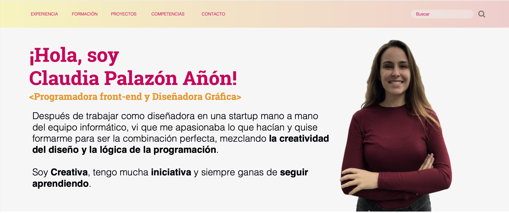

# Hola! 👋

Actualmente he terminado un bootcamp de programación FrontEnd con la escuela Adalab (puedes echar un vistazo a su web aquí: https://adalab.es)

A su vez, pertenezco a la escuela 42 Madrid de Programación (puedes echar un vistazo a su web aquí: https://www.42madrid.com)

### Conocimientos de desarrollo: 🔭

- Maquetación: HTML5, CSS3, Flexbox, CSS Grid, SASS, Bootstrap
- JavaScript (ES6) y servicios web (APIs) de terceros
- Programación en C
- Control de versiones con Git
- Creación de SPAs sencillas con React
- Manejo de Github, Trello, VS Code, Terminal, Zeplin
- Experiencia desarrollo de proyectos usando la filosofía Ágil y marco de trabajo Scrum

Además, ¡soy Diseñadora gráfica! Tengo el grado en Diseño Integral y Gestión de la Imagen, impartido por la Universidad Rey Juan Carlos de Madrid.

### Conocimientos de diseño: 🔭

- Paquete Adobe (Photoshop, Illustrator, Indesign)
- Conocimientos de Wordpress
- Experiencia en diseño UX y UI

## ¿Quieres conocerme o saber un poco más de mí?

Puedes mandarme un correo aquí: claupanon@gmail.com

Contactarme a través de Linkedin: https://www.linkedin.com/in/claudiapalazon/

<!--
**claudiapalazon/claudiapalazon** is a ✨ _special_ ✨ repository because its `README.md` (this file) appears on your GitHub profile.

Here are some ideas to get you started:

- 🔭 I’m currently working on ...
- 🌱 I’m currently learning ...
- 👯 I’m looking to collaborate on ...
- 🤔 I’m looking for help with ...
- 💬 Ask me about ...
- 📫 How to reach me: ...
- 😄 Pronouns: ...
- ⚡ Fun fact: ...
-->
